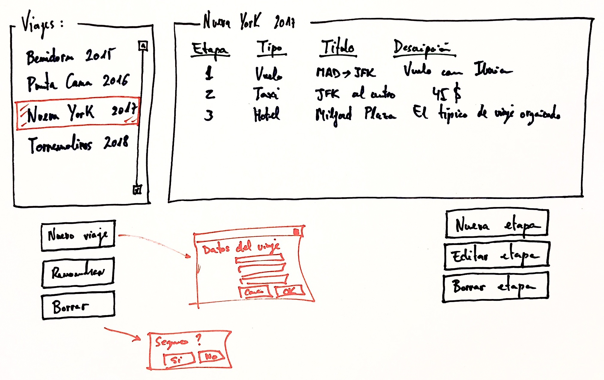

# Ejercicio 4 - Viajes

Queremos llevar un diario de nuestros viajes por el mundo y para ello vamos a crear una aplicación Java con interfaz de usuario Swing.

## Base de datos

Utilizará una base de datos MySQL en la que almacenaremos la información que gestiona la app:

- Un viaje tiene título y está compuesto de estapas.
- Una etapa es de un tipo concreto (vuelo, taxi, hotel...) y queremos guardar su título y una descripción.

Como servidor de base de datos, se recomienda utilizar la máquina virtual [Scotch Box](https://github.com/Egibide/scotch-box).

## Interfaz de usuario

El interfaz de usuario de la aplicación usará una estructura maestro-detalle como esta:

Los viajes se mostrarán en un `JList` y las etapas que lo componen en un `JList` o en un `JTable`.

Aparte de la ventana principal, se pueden generar tantos formularios como hagan falta para completar la aplicación.

## Operaciones a implementar

La aplicación permitirá realizar las operaciones [CRUD](https://es.wikipedia.org/wiki/CRUD) típicas con los datos:

- Crear un viaje.
- Renombrar un viaje.
- Borrar un viaje (y todas sus etapas).
- Crear una etapa.
- Editar los datos de una etapa.
- Borrar una etapa.

## Extras

Opcionalmente, en vez de usar botones como en el boceto, sería interesante utilizar menús de tipo [JMenu](https://docs.oracle.com/javase/tutorial/uiswing/components/menu.html).
